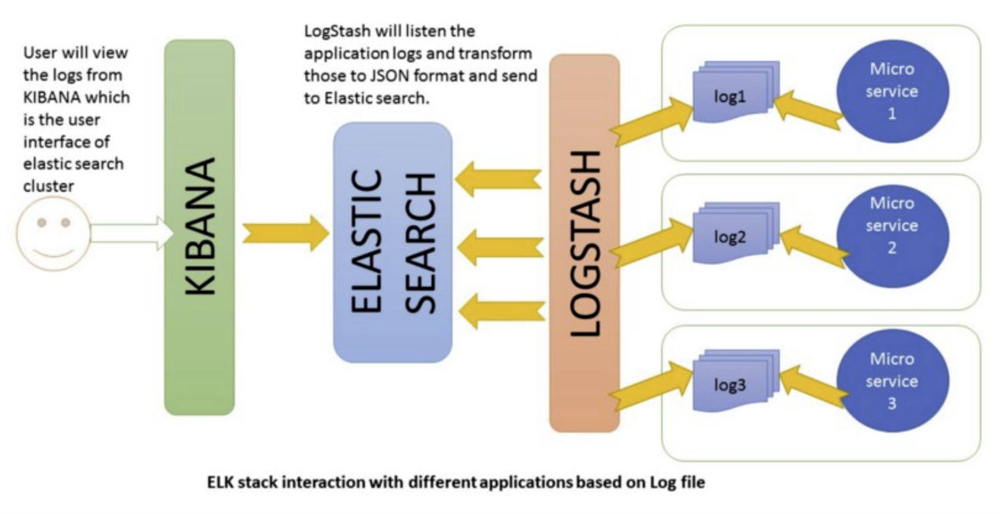

# Deploying an ELK Stack 
 
[source](https://howtodoinjava.com/)

### What is ELK?
- ElasticSearch 
    - 
- Logstash
    - 
- Kibana:
    - 

ELK hangs in terminal, so it makes sense to deploy it on a VM or container to have continious access.

## Pre-requisites and Steps: 
To access:
- an internet connection

To deply:
- JDK
- terraform 
- an aws account
- a unix terminal
