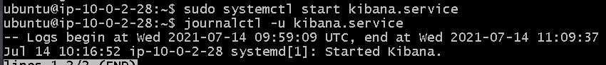

# Requirements:
1. Deploy an ELK stack in a Linux system 
2. A reasonable volume of logs appear on Kibana (done)

## Notes:
I'm not comfortable with ELK but the task is to **deploy** it. I don't need to know everything just basic knowledge of what elk does and what pre-requisites it needs to run. It is very user friendly, so can use the UI for a lot of things, e.g dashboards. 

- create python script that produces some kind of logs (done)
    - [This tutorial](https://www.freecodecamp.org/news/how-to-use-elasticsearch-logstash-and-kibana-to-visualise-logs-in-python-in-realtime-acaab281c9de/) has a good example of a python script to generate random logs. Although the creator had to run it multiple times to generate enough logs, so maybe create a hanging script. e.g create a log every 2 mins. 
    - achieved this by adding a `while` loop with `time.sleep(120`))
    - started the script to build up some logs while i continue working. 
    - using `&` at the end of the command will [run it in the background](https://www.maketecheasier.com/run-bash-commands-background-linux/), eliminating the need for multiple terminal instances. 
- run elk locally and document steps for setup
    - steps on mac (local): 
        - download and unzip files
        - cd into kibana directory and `bin/kibana` and do the same for elasticsearch
        - **Here I ran into some issues**:
            - localhost not working (even though it has been fine for other projects, proxy might be causing the problem)
            - problems SSH into ec2 instance, going to try it from another computer as I think this one's firewall is blocking it.  
        - Can access from http://127.0.0.1:9200/, kibana can be accessed from http://127.0.0.1:5601/
        
        
        - Hooked up kibana to logstash using the logstash_example.conf file:
        
        - Created local dashboard using the kibana UI.
    - going to try and run it straight from an ec2 instance: 
        - my aws account doesn't have default vpcs anymore, need to bring up an infrastructure before I can run anything. 
        - console is long & cumbersome, use terraform to bring up simple 1-tier architecture, public for now. 
            - note no instance is created from the terraform script, need to do this manually in console to create an ssh key for other laptop. 
        - succesfully created 1-tier architecture with terraform, created an instance manually through console and SSHed into it
        - see `/provisioning/linux_setup.sh` for linux setup process 
        - need to open port 5601 (kibana), 9200 + 9300 (elasticsearch) and 5000 (logstash)
        - after installing kibana, it seems like the server is struggling, may need more storage. 
            - resolved with t2.medium instance and 16g storage option
        - elasticsearch and kibana both started, but I can't access the UI from the public ip of the machine. 
            
        - `curl http://localhost:5601` returns nothing, config issue with kibana? 
        - can't access the public ip of the instances from my local machine, after checking the SGs and NACLs
        - I did attempt to edit config files for both elasticsearch and kibana but it seems like the above issue is a networking one. 
            - Need to set up completely open infrastructure to confirm if it's a config issue or a networking issue. 

- create terraform infrastructure to host the elk stack and deploy to an instance there (done)
    - need to refactor this to allow specific ports for elk (have done this manually in console for now)
    - need to close up nacls (specifically ssh)

# Increments:
3. Prepare some dashboards in Kibana (done)

4. Set up some filters in Logstash to blacklist/transform logs
5. Replace Kibana with Greylog

## Notes
- Imported logs and created dashboard on local 
    - increment to create continious dashboard from ongoing script on ec2, but the UI is not working :/ 

# Additional: 
- Research Puppet and Prometheus
- Research scaling, particularly 'sharding' 
- Consider other deployment methods:
    - kube
    - docker
    - azure
    - gcp 
